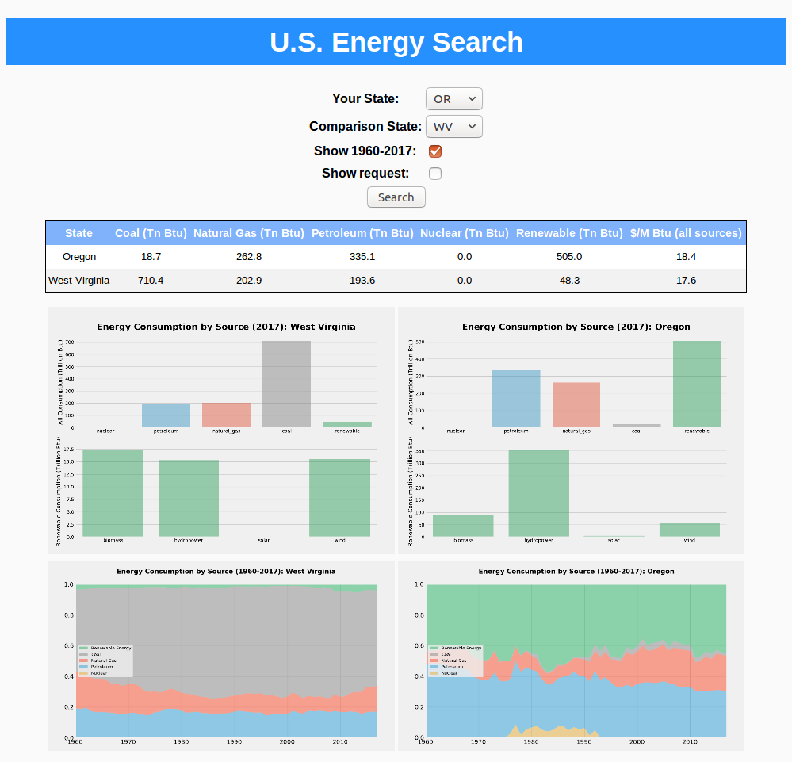

# U.S. Energy Consumption Trends Search Engine

## Project Description
This is a search engine of the energy consumption trends in U.S. states that outputs an energy source table and visual representations of consumption trends over time. It uses a [Django](https://www.djangoproject.com/) web framework to display a search tool interface with data visualization option to look at a particular state or choose to compare with another state its energy consumption patterns and prices in 2017 (the latest year available), as well as historical time series of energy consumption by source. The state-level data for the project was imported from the [U.S. Energy Information Administration (EIA)](https://www.eia.gov/) website via web scraping and API. 

Contributors:
L. Dinh
E. Son
E. Zhang




## Usage

### Activating your environment

To install the required packages in a new environment:
```bash
$ python3 -m venv env
$ source env/bin/ac
$ pip install -r requirements.txt
```
`requirement.txt` contains the required packages to run our program.


### Running a command in your environment

Run shell script to launch a command-line utility that lets you interact with this Django project. 
```bash
$ ./run_software.sh
```
Adding `-d` will re-pull the data from web scraping and API

Adding `-g` will recreate graphs from the database

Once the interface is started, you can use it by pointing a browser to `http://127.0.0.1:8000/`.


## Structure of the software

1. Data collecting and schema building scripts:
    - `webscraper.py`: Scrapes 2017 data from EIA website on on [energy consumption by source] (https://www.eia.gov/state/seds/seds-data-complete.php?sid=US). The script crawls the index page and retrieves the datasets of interest for year 2017. The relevant datasets are then saved in the “data” folder.
    - `pull_api.py`: Leverages EIA’s API to retrieve trend data for a longer time period (1960 - 2017), which is not available in a web page format. The relevant datasets are saved in the “data” folder.
    - `db.sql`: sql file that converts data retrieved from web scraping and API into a sql3.lite database.

2. Data visualization/display scripts:
    - `make_2017_graph.py`: Python script that creates graphs showing the total energy consumption pattern by state in 2017. All the graphs are created and saved in the “static/graphs” folder. When a user selects a state, we’ll find the correct path of the state’s graph to display.
    - `make_1960_2017_graph.py`: Python script to create graphs showing the total energy consumption pattern by state for 1960-2017. All the graphs are created and saved in the “static/graphs” folder. When a user selects a state, we’ll find the correct path of the state’s graph to display.
    - `make_2017_table.py`: Python script that queries data on the total energy consumption pattern by state in 2017 from the database we created above. Convert the data into a formatted table to be displayed when a user selects a state.

3. Django scripts: 
Following the standard structure of a Django application, there are 3 main folders:
    - `search` folder contains html template and codes to display the correct visualizations selected by the users.
    - `static` folder contains css style and graphs generated from our data visualization scripts (to be displayed as static components in css structure).
    - `ui` folder contains Django default setup and scripts.

